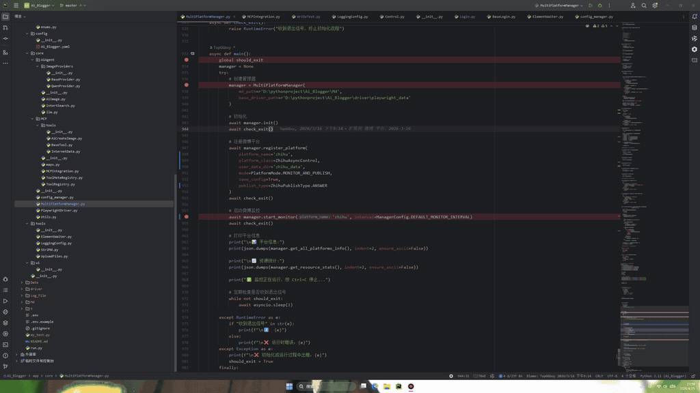
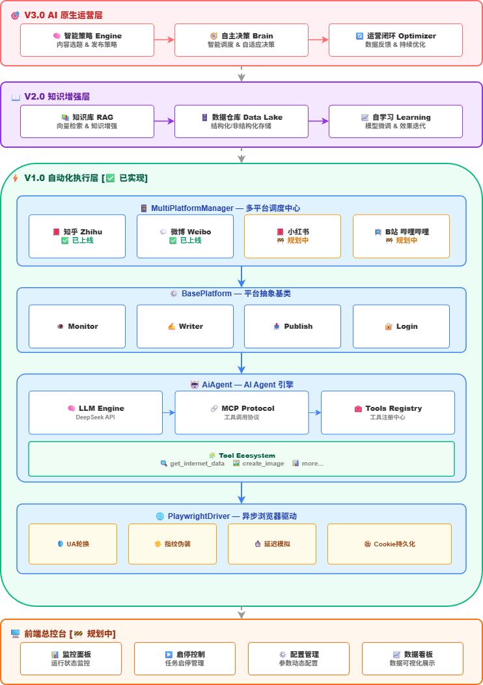

# AI Blogger

<p align="center">
  <strong>AI 驱动的多平台自媒体智能运营系统</strong>
</p>

<p align="center">
  
  
  
  
  
  
</p>

<p align="center">
  <a href="#项目简介">项目简介</a> •
  <a href="#项目架构">项目架构</a> •
  <a href="#技术栈">技术栈</a> •
  <a href="#核心能力">核心能力</a> •
  <a href="#快速开始">快速开始</a> •
  <a href="#项目结构">项目结构</a> •
  <a href="#roadmap">Roadmap</a>
</p>

---

> **愿景**：打造下一代 AI 原生内容运营平台，从"自动化执行工具"进化为"自主进化的智能运营伙伴"
>
> **当前状态**：已完成知乎、微博平台全链路自动化 + V1.5 质量增强管线，日均稳定产出 10+ 篇优质内容

---

## 项目简介

**AI Blogger** 是一个面向内容创作者和自媒体运营者的下一代 AI 驱动自动化系统。区别于传统的脚本化工具，本系统采用** Agent 架构**，通过 MCP（Model Context Protocol）协议实现 LLM 与外部工具的深度集成，具备：

- 🔍 **智能热点感知**：多平台热榜实时监控，捕捉内容创作时机
- ✍️ **类人创作引擎**：基于 DeepSeek 大模型 + 联网搜索，生成具有个人风格的原创内容
- 🚀 **全平台自动化发布**：跨平台内容适配，一键分发至多个社交媒体
- 🛡️ **反检测伪装**：模拟真人操作轨迹，规避平台风控检测
- 🧠 **可扩展架构**：模块化设计，支持快速接入新平台和新工具

### 应用场景

| 场景 | 描述 |
|------|------|
| **多账号运营** | 个人博主一人管理多个平台账号，内容批量生产分发 |
| **热点响应** | 突发事件第一时间追踪热点，快速产出优质内容 |
| **内容矩阵** | 企业品牌多平台内容布局，统一管理运营策略 |
| **AI 研究** | Browser Agent / MCP 协议 / LLM 工程实践参考 |

### 效果演示



---

## 项目架构

### 整体架构图（含未来演进）



### 模块说明

| 层级 | 模块 | 描述 | 状态 |
|------|------|------|:----:|
| **前端层** | 前端总控台 | Web Dashboard，监控/启停/配置/数据分析 | 🚧 |
| **V3.0** | 智能策略引擎 | AI 自主决策运营策略 | 🚧 |
| **V3.0** | 自主决策脑 | 从规则驱动到意图驱动 | 🚧 |
| **V2.0** | 知识库 RAG | 私有知识检索，增强创作专业度 | 🚧 |
| **V2.0** | 数据仓库 | 多平台数据分析，洞察内容表现 | 🚧 |
| **V2.0** | 自学习机制 | 从运营数据中持续优化创作策略 | 🚧 |
| **V1.0** | 多平台调度中心 | 统一管理多平台运营任务 | ✅ |
| **V1.0** | 平台抽象基类 | 统一接口，快速接入新平台 | ✅ |
| **V1.0** | AI Agent 引擎 | LLM + MCP + Tools 核心 | ✅ |
| **V1.0** | 浏览器驱动 | 反检测自动化操作 | ✅ |
| **V1.5** | ContentPipeline | 质量增强流水线（信息增强/风格锚定/质检门禁） | ✅ |
| **V1.5** | 信息增强引擎 | 多源信息收集、竞品拆解、素材包构建 | ✅ |
| **V1.5** | 质量评估门禁 | LLM-as-Judge 多维度打分 + 迭代优化 | ✅ |
| **V1.5** | PromptManager | 提示词统一管理 + 版本控制 + 回退机制 | ✅ |
| **V2.0** | 知识库 RAG | 私有知识检索，增强创作专业度 | 🚧 |

---

## 技术栈

| 类别 | 技术选型 | 说明 |
|------|----------|------|
| **语言** | Python 3.10+ | 类型注解、协程支持 |
| **运行时** | asyncio + async/await | 事件驱动非阻塞调度 |
| **浏览器自动化** | Playwright | 跨浏览器支持，多 Context 隔离 |
| **AI 能力** | DeepSeek API | Chat + Reasoning 双模型 |
| **工具协议** | MCP (Model Context Protocol) | LLM 与外部工具的标准化接口 |
| **配置管理** | YAML + dotenv | 环境隔离，敏感信息安全 |

---

## 核心能力

### 已实现功能

| 模块 | 描述 | 技术亮点 |
|------|------|----------|
| 🔥 **热点监控** | 多平台热榜定时轮询，智能检测新热点 | 增量检测 + 去重缓存 |
| ✍️ **AI 写作引擎** | DeepSeek 驱动 + 联网搜索增强 | 多轮对话迭代生成 |
| 🖼️ **AI 配图** | 通义千问 API，文章自动配图 | 支持多种风格 |
| 🚀 **自动化发布** | Playwright 驱动，自动填写编辑器 | 回答/文章/长文全覆盖 |
| 🛡️ **反检测系统** | UA 轮换 / Canvas 指纹 / 操作延迟 | 账号 0 风控记录 |
| 🍪 **Cookie 持久化** | 登录态自动保存复用 | 支持多账号隔离 |
| ⚡ **并发调度** | 单 Browser + 多 Context | 多平台同时运行 |
| 🔄 **智能重试** | 指数退避 (1s/3s/7s) + 超时控制 | API 成功率 97%+ |
| 📊 **信息增强引擎** | 多源信息收集、竞品拆解、素材包构建 | 深度内容支撑 |
| 🎯 **风格锚定系统** | Few-Shot 风格参考，人设一致性 | 个性化内容输出 |
| ✅ **质量评估门禁** | LLM-as-Judge 多维度打分 + 迭代优化 | 质量下限保障 |
| 🔄 **迭代优化机制** | 不合格内容自动重写，最多 2 轮迭代 | 持续精炼输出 |
| 📝 **提示词管理系统** | 版本控制 + 自定义覆盖 + 历史回滚 | 可追溯可回退 |

### V1.5 质量增强流水线

```
┌─────────────────────────────────────────────────────────────────┐
│                    ContentPipeline 质量增强管线                  │
│                                                                 │
│  ┌──────────┐   ┌──────────────┐   ┌──────────────┐           │
│  │ ① 信息   │──▶│ ② 初稿      │──▶│ ③ 质检      │           │
│  │  增强层  │   │  生成        │   │  评估        │           │
│  └──────────┘   └──────────────┘   └──────┬───────┘           │
│       │                │                 │                     │
│       ▼                ▼            通过? │ 不通过             │
│  ┌──────────┐   ┌──────────────┐        ▼    ▼              │
│  │ 热点分析 │   │ LLM + Tools  │   ┌────────┐ ┌──────────┐  │
│  │ 多源搜索 │   │ Prompt驱动   │   │ ④ 发布 │ │⑤ 迭代   │  │
│  │ 竞品拆解 │   │ 风格锚定     │   └────────┘ └────┬─────┘  │
│  └──────────┘   └──────────────┘                  │         │
│                                                  ▼          │
│                                           回到②重新生成      │
└─────────────────────────────────────────────────────────────────┘
```

**质检维度：**
- 手写感（是否有 AI 模板痕迹）
- 信息密度（干货 vs 空泛观点）
- 观点独特性（个人鲜明立场）
- 结构可读性（段落/排版/节奏）
- 社区适配度（平台氛围契合度）

**质量门禁：** 平均分 ≥ 7.0 才允许发布，不合格内容自动迭代优化（最多 2 轮）

---

## 提示词管理系统（PromptManager）

### 核心设计理念

提示词是 AI 创作质量的灵魂。本系统提供**企业级的提示词管理能力**，支持版本控制、实时回滚、自定义覆盖，无需修改源码即可调整 AI 行为。

### 架构概览

```
┌─────────────────────────────────────────────────────────────────┐
│                     PromptManager 全局入口                       │
│                                                                 │
│  ┌─────────────┐    ┌──────────────┐    ┌──────────────┐     │
│  │  加载优先级  │    │   版本控制    │    │   缓存机制   │     │
│  │ custom >    │    │  Git-like    │    │  LRU + 热更新 │     │
│  │ active >    │    │  快照 + diff  │    │  检测外部修改 │     │
│  │ default     │    │              │    │              │     │
│  └─────────────┘    └──────────────┘    └──────────────┘     │
│                                                                 │
│  ┌──────────────────────────────────────────────────────────┐  │
│  │                    registry.json                         │  │
│  │          (提示词注册表，自动维护所有提示词索引)              │  │
│  └──────────────────────────────────────────────────────────┘  │
└─────────────────────────────────────────────────────────────────┘

┌─────────────────────────────────────────────────────────────────┐
│                     提示词加载优先级                              │
│                                                                 │
│  1️⃣  custom/{prompt_id}.json      用户自定义（最高优先级）       │
│       ↓ 不存在时                                                  │
│  2️⃣  {platform}/{id}.json         运行时激活版                   │
│       ↓ 不存在时                                                  │
│  3️⃣  {platform}/{id}_default.json 出厂默认（首次自动复制）      │
└─────────────────────────────────────────────────────────────────┘
```

### 核心能力

| 功能 | 描述 | 亮点 |
|------|------|------|
| **版本控制** | 每次修改自动创建快照，保留完整历史 | 类似 Git，每次变更可追溯 |
| **版本对比** | unified_diff 差异分析 | 可视化变更内容 |
| **一键回滚** | 回退到任意历史版本 | 支持多次回滚，版本号自动标记 |
| **自定义覆盖** | 在 `prompts/custom/` 创建同名文件即覆盖 | 无需修改源码，灵活实验 |
| **热更新检测** | 自定义文件外部修改后自动重载 | 无需重启服务 |
| **缓存优化** | 内存缓存 + mtime 检测 | 高频调用场景零 IO |
| **自动初始化** | 首次加载自动从 default 复制激活版 | 开箱即用 |

### API 接口

```python
from app.core.PromptManager import get_prompt_manager

pm = get_prompt_manager()

# 获取提示词
prompt = pm.get_prompt("zhihu_answer")
print(prompt.content)

# 查看历史版本
history = pm.get_history("zhihu_answer")
for record in history:
    print(f"{record.version_id} - {record.change_reason}")

# 对比两个版本
diff = pm.compare_versions("zhihu_answer", "v_20260513_100000", "v_20260513_143022")
print(diff.changes_summary)

# 更新提示词（自动创建快照）
pm.update_prompt("zhihu_answer", new_content, change_reason="优化开头段落")

# 回滚到指定版本
pm.rollback("zhihu_answer", "v_20260513_100000")

# 列出所有提示词
prompts = pm.list_prompts(filter_platform="zhihu")
```

### 变更类型

| change_type | 说明 | 使用场景 |
|-------------|------|----------|
| `initial` | 初始版本 | 系统初始化 / JSON 文件迁移 |
| `manual` | 手动编辑 | 用户直接修改提示词 |
| `ai_optimized` | AI 优化 | AI 基于反馈数据自动调优 |
| `rollback` | 回滚操作 | 用户回退到历史版本 |

### 版本号规范

- **主版本.次版本.补丁版本**：如 `1.0.0`、`1.5.2`
- **回滚版本**：目标版本 + `-rb`，如 `1.0.0-rb`、`1.0.0-rb.2`（多次回滚同一目标）

### 已注册提示词

| ID | 平台 | 用途 | 状态 |
|----|------|------|------|
| `zhihu_answer` | 知乎 | 热榜回答创作 | ✅ |
| `zhihu_article` | 知乎 | 文章长文创作 | 🚧（待完善） |
| `weibo_article` | 微博 | 头条文章创作 | ✅ |

### 已支持平台

| 平台 | 登录 | 热榜监控 | 发布文章 | 发布回答 |
|------|:----:|:--------:|:--------:|:--------:|
| 知乎 | ✅ | ✅ | ✅ | ✅ |
| 微博 | ✅ | ✅ | ✅ | - |

### MCP 工具生态

| 工具 | 功能 | 状态 |
|------|------|:----:|
| `get_internet_data` | 联网搜索最新资讯 | ✅ |
| `create_image` | AI 图片生成 | ✅ |
| 扩展工具 | 接入更多 MCP 服务 | 🚧 |

---

## 快速开始

### 环境要求

- Python >= 3.10
- Chromium (通过 Playwright 安装)
- DeepSeek API Key

### 安装

```bash
# 克隆项目
git clone https://github.com/<your-username>/Ai_Blogger.git
cd Ai_Blogger

# 创建虚拟环境
python -m venv venv
# Windows
venv\Scripts\activate
# Linux/Mac
source venv/bin/activate

# 安装依赖
pip install -r requirements.txt

# 安装浏览器
playwright install chromium
```

### 配置

```bash
cp .env.example .env
```

编辑 `.env` 填入你的凭据：

```env
DEEPSEEK_API_KEY=sk-your-key
ZHIHU_USERNAME=your_zhihu_username
ZHIHU_PASSWORD=your_zhihu_password
WEIBO_USERNAME=your_weibo_username
WEIBO_PASSWORD=your_weibo_password
```

> ⚠️ **提示**：完整发布功能需要合法平台账号。如仅体验 AI 生成流程，可在配置中关闭发布模块，查看生成内容是否满足需求。

### 运行

```bash
python -m app.core.MultiPlatformManager
```

按 `Ctrl+C` 安全退出。

---

## 项目结构

```
Ai_Blogger/
├── app/
│   ├── Bloggers/                     # 平台业务实现
│   │   ├── Base*.py                  # 抽象基类 (Monitor/Writer/Publish/Login)
│   │   ├── ZhihuBlogger/             # 知乎平台
│   │   │   ├── actions/              # 操作动作 (Login/SendAnswer/SendArticle)
│   │   │   ├── content/              # AI 内容创作
│   │   │   ├── scraping/             # 数据采集
│   │   │   └── Control.py            # 业务控制器
│   │   └── WeiboBlogger/            # 微博平台 (同结构)
│   │
│   ├── core/                         # 核心基础设施
│   │   ├── MultiPlatformManager.py   # 多平台调度中心
│   │   ├── PlaywrightDriver.py       # 异步浏览器驱动
│   │   ├── config_manager.py         # 配置管理
│   │   ├── AiAgent/                  # AI Agent 引擎
│   │   │   ├── llm.py                # LLM 调用封装
│   │   │   ├── IntertSearch.py       # 搜索增强
│   │   │   └── ImageProviders/       # 图片生成提供者
│   │   ├── MCP/                      # MCP 工具系统
│   │   │   ├── MCPIntegration.py     # MCP 集成核心
│   │   │   ├── ToolRegistry.py       # 工具注册中心
│   │   │   ├── ToolMetaRegistry.py   # 工具元数据
│   │   │   └── tools/                # 内置工具实现
│   │   └── ContentPipeline/          # 内容质量增强流水线 (V1.5)
│   │       ├── ContentPipeline.py    # 主流水线编排
│   │       ├── InfoEnricher.py       # 信息增强引擎
│   │       └── QualityGate.py        # 质量评估门禁
│   │   └── PromptManager/            # 提示词管理系统
│   │       ├── manager.py           # 提示词管理器（全局入口）
│   │       ├── models.py            # 数据模型（Prompt/VersionRecord）
│   │       └── version_control.py   # 版本控制引擎
│   │
│   ├── tools/                        # 通用工具
│   │   ├── ElementWaiter.py          # 元素等待器
│   │   ├── LoggingConfig.py           # 日志配置
│   │   └── Md2Docx.py                # 格式转换
│   │
│   └── config/
│       └── Ai_Blogger.yaml           # 主配置文件
│
├── prompts/                          # 提示词资源库
│   ├── registry.json                # 提示词注册表（自动维护）
│   ├── zhihu/                      # 知乎平台提示词
│   │   ├── answer.json            # 回答创作提示词
│   │   └── article.json           # 文章创作提示词
│   ├── weibo/                     # 微博平台提示词
│   │   └── article.json
│   └── custom/                    # 用户自定义覆盖区（优先级最高）
│
├── prompts_history/                 # 提示词版本快照
│   └── {prompt_id}/
│       ├── manifest.json          # 版本索引清单
│       └── v_*.json              # 版本快照文件
│
├── Data/                             # 运行时数据
│   ├── temp/                         # 临时文件
│   └── *_essays.json                 # 生成的文案
├── driver/                           # 浏览器状态
│   └── playwright_data/              # Cookie 持久化
├── Log_File/                         # 运行日志
├── Md/                               # Markdown 产出物
├── docs/                             # 文档资源
├── .env.example                      # 环境变量模板
└── requirements.txt                  # 依赖清单
```

---

## Roadmap

### ✅ V1.5 质量增强（已完成）

| 功能 | 描述 | 状态 |
|------|------|:----:|
| ContentPipeline | 质量增强流水线编排 | ✅ |
| 信息增强引擎 | 多源信息收集、竞品拆解、素材包构建 | ✅ |
| 风格锚定系统 | Few-Shot 风格参考，个性化内容输出 | ✅ |
| 质量评估门禁 | LLM-as-Judge 多维度打分（手写感/信息密度/观点独特性等） | ✅ |
| 迭代优化机制 | 不合格内容自动重写，最多 2 轮迭代 | ✅ |
| PromptManager | 提示词统一管理 + 版本控制 + 回滚机制 | ✅ |

### 🔴 进行中

| 功能 | 描述 | 优先级 |
|------|------|:------:|
| 平台扩展 | 小红书、B站视频、微信公众号 | P0 |

### 🟡 规划中

| 功能 | 描述 | 阶段 |
|------|------|------|
| **Prompt A/B 测试** | 多版本 Prompt 对比实验，自动化选出最优版本 | V2.0 |
| **知识库 + RAG** | 接入私有知识库，提升内容专业度和垂直领域深度 | V2.0 |
| **风格锚点样本库** | 扩充不同话题类型的风格范文，覆盖更多创作场景 | V2.0 |
| **AI 自学习机制** | 运营数据闭环，让 AI 从实际效果中学习和迭代创作策略 | V2.1 |
| **前端总控台** | Web Dashboard，支持自动化监控、启停、配置管理 | V2.2 |
| **数据仓库** | 多平台数据分析，洞察内容表现，优化创作方向 | V2.3 |
| **AI 驱动自动化** | 从"规则驱动"到"意图驱动"，AI 自主决策运营策略 | V3.0 |

### 架构演进

```
                    AI Blogger 发展路径

┌─────────────────────────────────────────────────────────────────────────┐
│                                                                          │
│   V1.0 ─────────── V1.5 ─────────── V2.0 ─────────────── V3.0          │
│  ┌─────────┐      ┌─────────┐      ┌─────────┐      ┌─────────┐      │
│  │ 自动化   │      │ 质量增强 │      │ 知识增强 │      │ AI原生  │      │
│  │ 执行层   │ ───▶ │ 创作层   │ ───▶ │ 创作层   │ ───▶ │ 运营层   │      │
│  └────┬────┘      └────┬────┘      └────┬────┘      └────┬────┘      │
│       │                │                │                │            │
│       ▼                ▼                ▼                ▼            │
│  ┌─────────┐      ┌─────────┐      ┌─────────┐      ┌─────────┐      │
│  │ AI执行  │      │ AI创作  │      │ AI创作  │      │ AI运营  │      │
│  │ 任务    │      │ 质量+   │      │ 专业化  │      │ 自主决策 │      │
│  └─────────┘      └─────────┘      └─────────┘      └─────────┘      │
│                                                                          │
│   替代人工操作        提升内容质量         垂直领域深度      从工具到伙伴  │
│   提升效率80%        风格一致性+质检       专业知识支撑       真正的智能体   │
│                                                                          │
├─────────────────────────────────────────────────────────────────────────┤
│  核心能力     ✅ 热点监控      ✅ 质量评估门禁                             │
│              ✅ AI写作        ✅ 迭代优化机制                             │
│              ✅ 自动发布      ✅ 信息增强引擎                             │
│              ✅ 反检测        ✅ 风格锚定系统                             │
│              ✅ 并发调度      ✅ 提示词管理/版本控制                      │
│              ✅ 智能重试      🚧 知识检索增强/RAG                        │
│              ✅ 自定义覆盖    🚧 数据分析                                 │
│                                                                          │
└─────────────────────────────────────────────────────────────────────────┘
```

---

## 许可证

[](https://opensource.org/licenses/MIT)

Copyright © 2024-2025 Ai_Blogger

本项目采用 **MIT 许可证** 开源。查看 [LICENSE](./LICENSE) 获取完整条款。

### 致谢

本项目的运行离不开以下优秀的开源项目：

| 项目 | 许可证 | 用途 |
|------|--------|------|
| [Playwright](https://github.com/microsoft/playwright) | Apache 2.0 | 浏览器自动化 |
| [OpenAI Python SDK](https://github.com/openai/openai-python) | MIT | LLM API 调用 |
| [PyYAML](https://github.com/yaml/pyyaml) | MIT | 配置解析 |
| [python-dotenv](https://github.com/theskumar/python-dotenv) | BSD 3-Clause | 环境变量管理 |
| [DeepSeek](https://platform.deepseek.com/) | — | 大语言模型服务 |

---

### 免责声明

> ⚠️ 本工具仅供学习 AI Agent 与浏览器自动化技术，请勿用于恶意刷量或违反平台规则的行为。
> 使用者需自行承担风险，遵守各平台服务条款与 robots 协议。作者不对因使用本工具导致的账号封禁、法律纠纷等后果承担责任。

---

<p align="center">
  Built with ❤️ using Python · Playwright · DeepSeek
</p>
